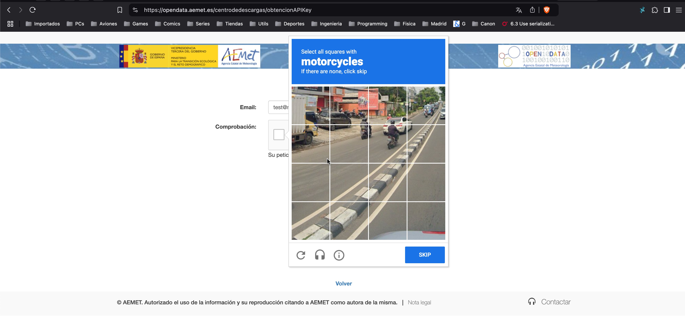
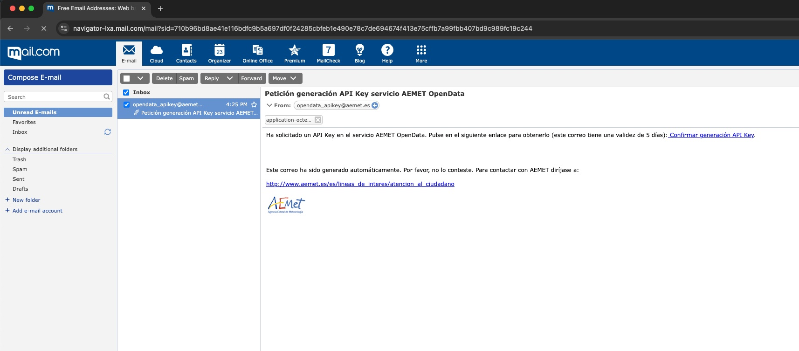

# playwright_ts_aemet_api
Testing the [AEMET API](https://opendata.aemet.es/dist/index.html?) with Playwright (Typescript)
  - Antartida REST API

## What the Test Does
1. Request API Token:
    - Sends a request to the AEMET service to obtain an API token.
2. Retrieve API Token:
    - Retrieves the API token from the email service.
3. Fetch Weather Data:
    - Uses the AEMET API to get the weather data.
4. Validate Data:
    - Checks and verifies the retrieved weather data.


## API Token Registration Process (and captcha)
The registration process for obtaining an API token requires clicking on a captcha box. This step is usually handled automatically by the test. However, occasionally a captcha challenge may appear.

When a captcha challenge is presented, it must be solved manually by the user within two minutes. The captcha service enforces a default time limit of two minutes to complete the challenge.



## About the emails and the email servers
During the registration process, a confirmation email is sent to the user. The user needs to click on a link within the email to confirm their email address. After this confirmation, the AEMET service sends the API token to the user's email address.

This process can be time-consuming. The automation in place waits up to 300 seconds (100 * 3 seconds) for each of the emails to arrive. This waiting time is configurable:

MAX_POLLING: 100

FAST_TIMEOUT: 3000 ms (3 seconds)

Note: During the development time, the average time to receive the email was around 24 seconds.



## Unexpected Behavior with the Mail.comEmail Service
Clicking on an email in the (unread) email list within the Mail.com email service can be unexpectedly difficult. Despite using the designated locator, the email does not always open.

This behavior is inconsistent and not always reproducible. I need additional time to debug and determine the root cause.
In the meantime a retry mechanism is in place to handle this issue.

## TODO
- There is a caveat in the implemented approach. A new email may arrive when the test is running. 
- So the test may pick up the wrong email as no check is in place to ensure the email is the correct one.
- The test should be improved to check the email subject and sender to ensure the correct email is being used.

## [Installation](docs/installation.md)

## Run tests
### Requirements
- Free account in the mail.com email service

### Registering a user in the AEMET service (getting an API token)
- Create an `.env.local` file
```bash
   cp .env.local.template .env.local
```
  - Configure the `.env.local` file with the credential values
  - Execute the test
```bash
    npm run test
```
  - The global setup will get the API token from the email service and store it in the `API_TOKEN` environment variable
  - The test will use the `API_TOKEN` environment variable to authenticate the requests to the AEMET API
  - The data from the AEMET server is fetched and checked 

### With an AEMET API token
- Create an `.env.local` file
```bash
   cp .env.local.template .env.local
```
  - Configure the `.env.local` file with the credential values
    - Set the value for the variable `API_TOKEN`
  - Execute the test
```bash
    npm run test
```
  - The test will use the `API_TOKEN` environment variable to authenticate the requests to the AEMET API
  - The data from the AEMET server is fetched and checked